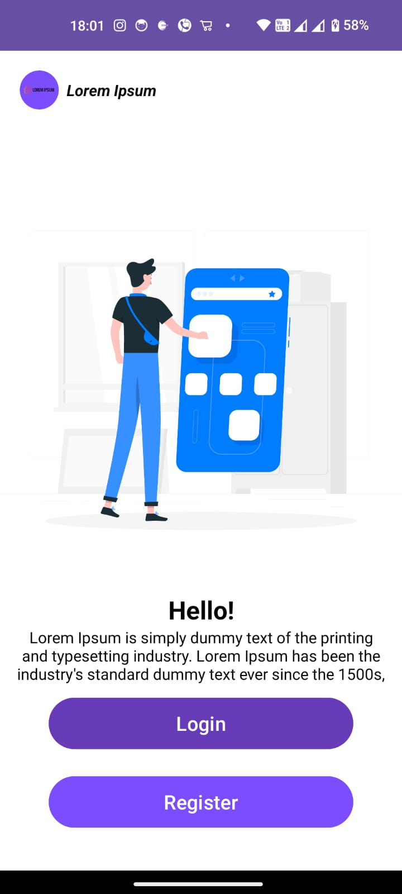
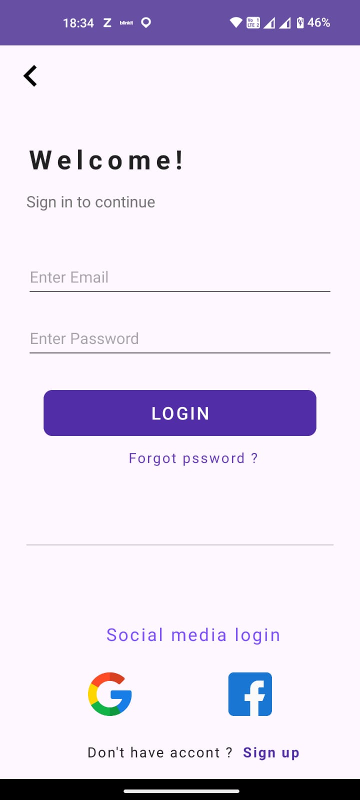

<h1 align="center"> Firebase logins  🔥 </h1> 

This is a Logins App built using Kotlin for Android, leveraging Firebase for authentication with Facebook and Google login options. The project demonstrates a clean and modern Android development approach with the following technologies:
--
- Kotlin
- Android Native
- Jetpack Components
   - DataBinding
   - Navigation Component
    - LiveData

- Features:
Firebase Authentication: Secure login using Firebase with Facebook and Google authentication.
Modern Android Architecture: Utilizes Jetpack components for seamless UI and state management.

- DataBinding: Ensures efficient binding of UI components in layouts.
Navigation Component: Handles in-app navigation effortlessly.

- LiveData: Manages UI-related data in a lifecycle-conscious way.

This project is a great reference for developers looking to implement authentication using Firebase in a Kotlin-based Android app while following modern Android development practices.
--
Screens
------------------------------------------------------------

 
    </img>
      </img>

  </a>

